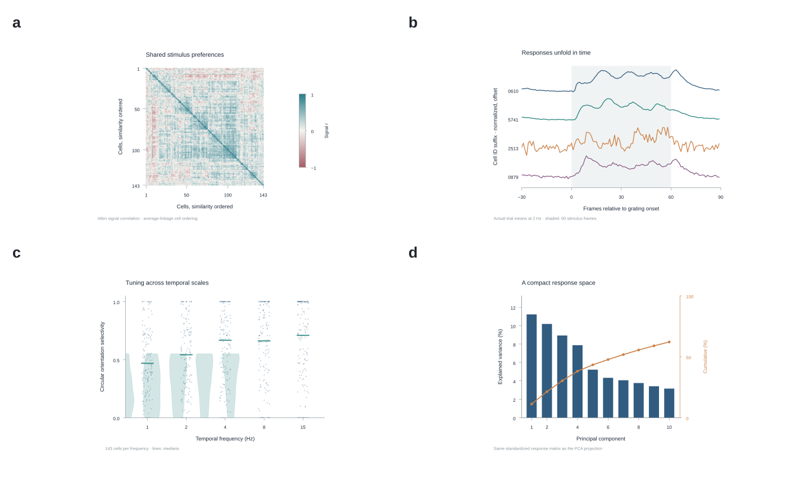

## A population view of neural information

A stimulus can recruit many neurons without producing the same response in every cell. We explore this simple idea through public neuronal recordings, reconstructed cell shapes and anatomical surfaces. Each view offers a different scale for the same question: how does activity across a population make information visible?

{#fig-neural-populations}

The visual story moves from anatomy to activity. Individual response profiles show preferences; a heatmap brings those profiles together; network and population-space views expose relationships between them. All panels were designed for this demonstration. They are exploratory illustrations, rather than evidence for the paper's intentionally broad working title.

## From a response map to a connected result

A single summary cannot show every relationship in a dataset. The figure combines complementary views while retaining the observations, plot sources and processing notes that produced each panel. The original data sources are identified in the project bibliography [@allenCellMorphologies; @allenVisualResponses; @allenMouseMeshes].

{#slide-neural-results .flux-slide deck="neural-populations" slide="results" width=100%}

## Variation is part of the pattern

Neurons differ in their response profiles, selectivity and shared activity. Looking at the individual measurements alongside the population summaries makes this variation visible. Distribution and paired-comparison panels preserve that detail, while the larger heatmap establishes the overall structure.

{#fig-neural-structure}

## A working example, ready to edit

The manuscript, compositions, plots and slides are ordinary project files. Their visual vocabulary is shared, so a selected neuron, response group or comparison remains recognizable as the explanation moves between a paper and a presentation.

## Data and interpretation

This is an original Flux showcase project, not a scientific report. Public source datasets supply the numerical and anatomical material; our selection, transformations, visual compositions and wording are new. Anatomical context and activity panels may come from different public specimens or experiments and must not be interpreted as one matched biological sample. The project methods and provenance records identify those boundaries.
