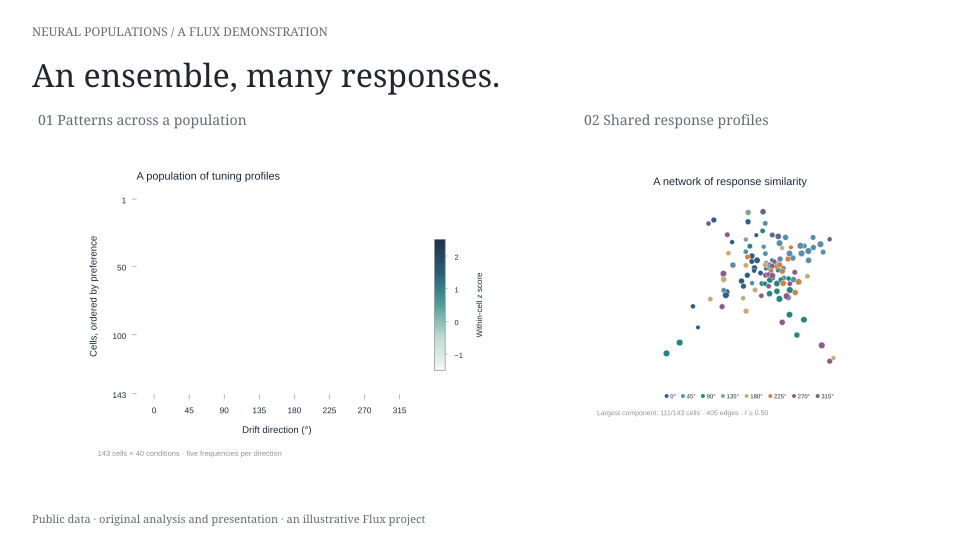
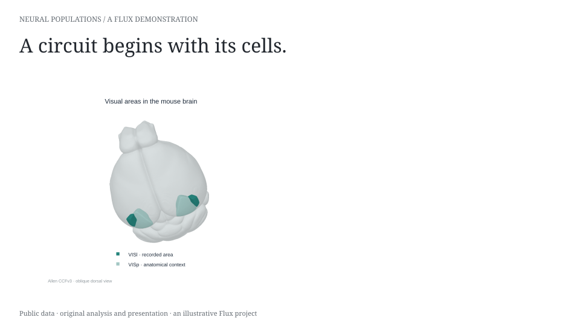
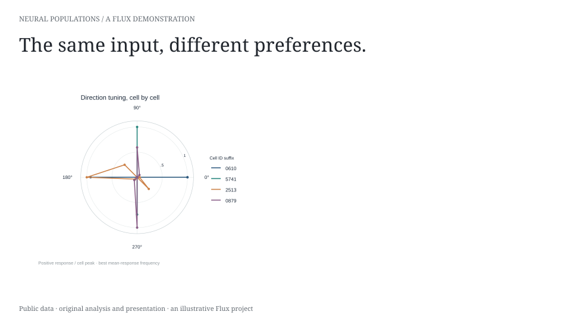
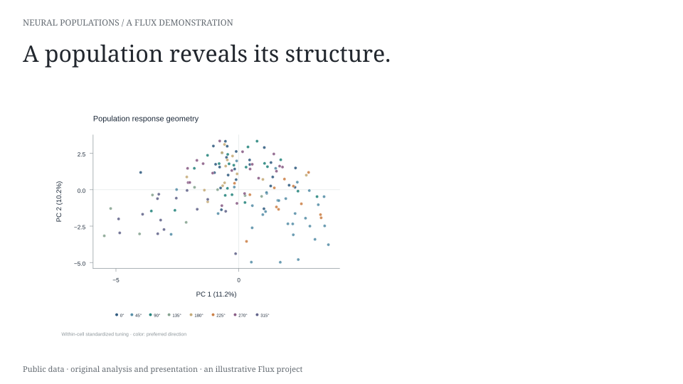

## Many neurons. Many responses.

{#slide-results-walkthrough .flux-slide deck="neural-populations" slide="results" width=100%}

## From anatomy to activity

{#slide-anatomy-walkthrough .flux-slide deck="neural-populations" slide="anatomy" width=100%}

## A diversity of responses

{#slide-tuning-walkthrough .flux-slide deck="neural-populations" slide="tuning" width=100%}

## Patterns in activity space

{#slide-population-walkthrough .flux-slide deck="neural-populations" slide="population" width=100%}
