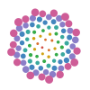
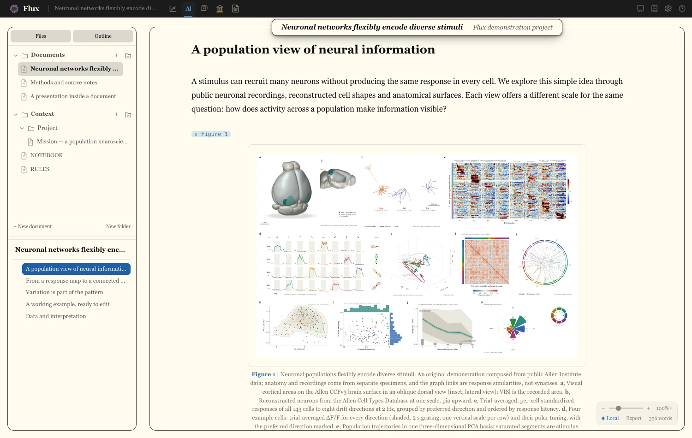
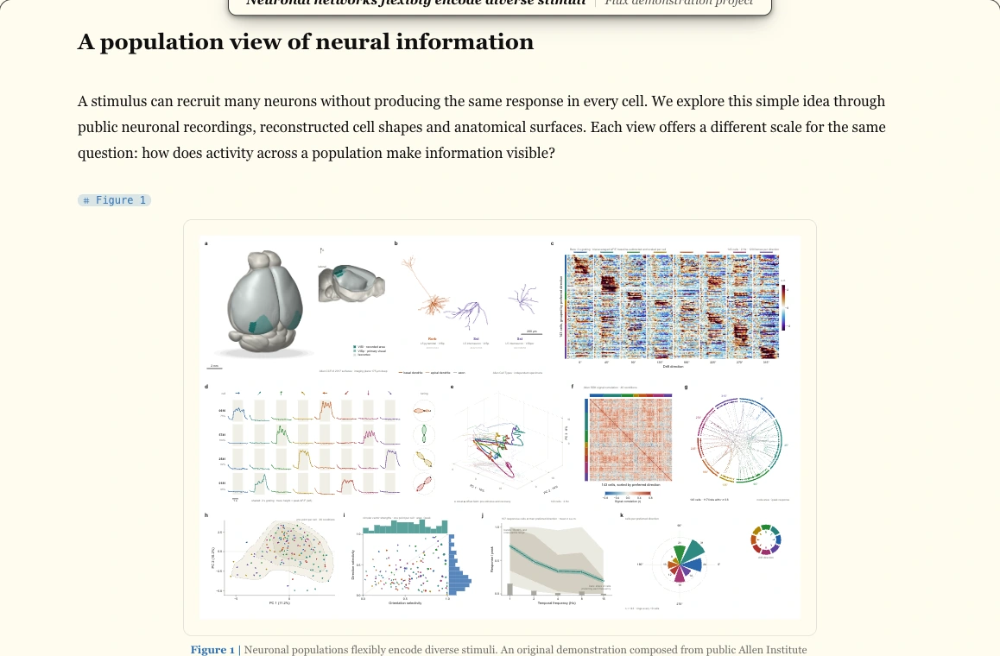
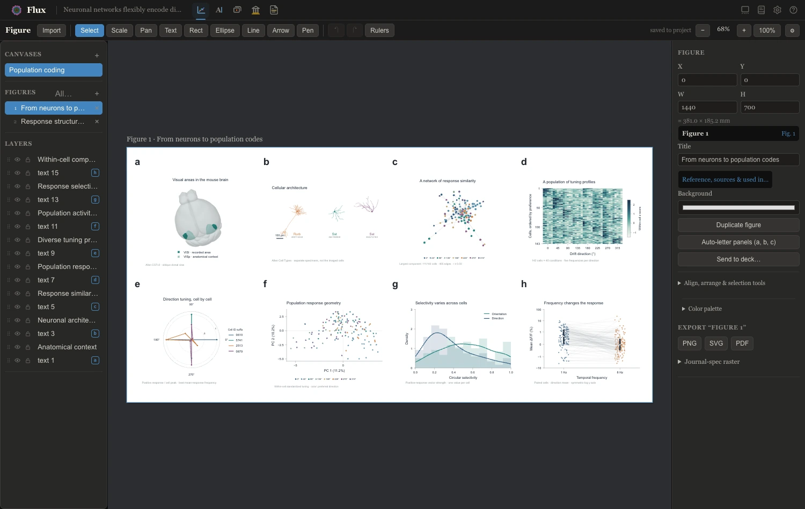
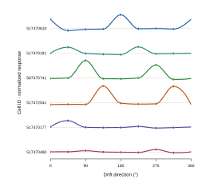
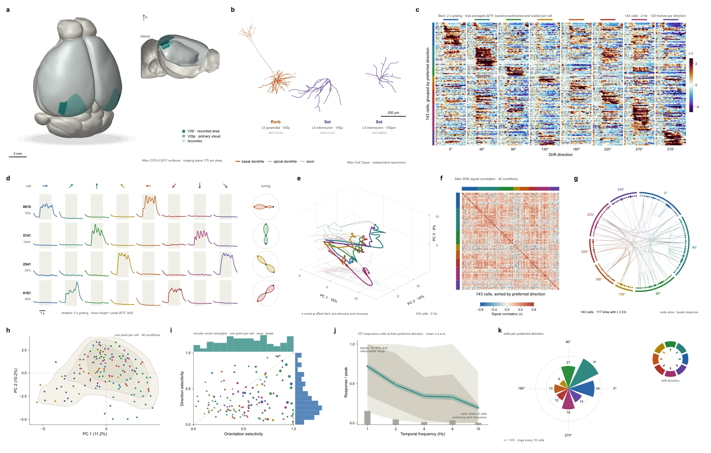
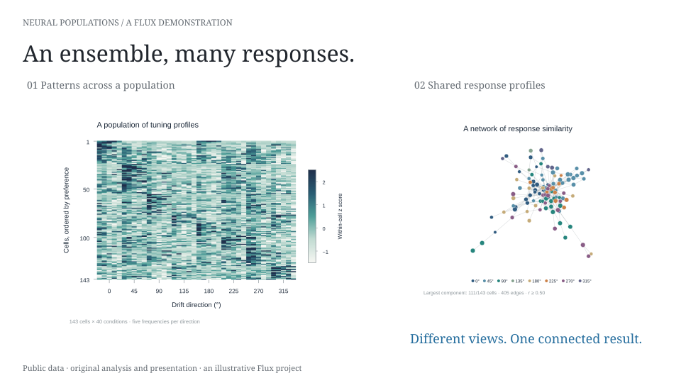
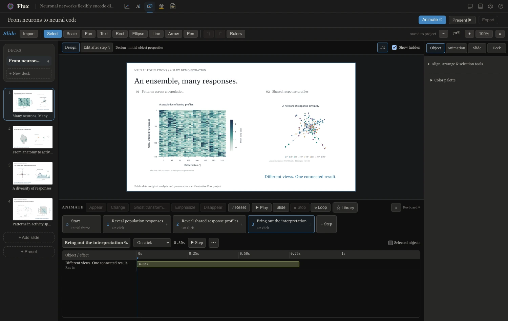
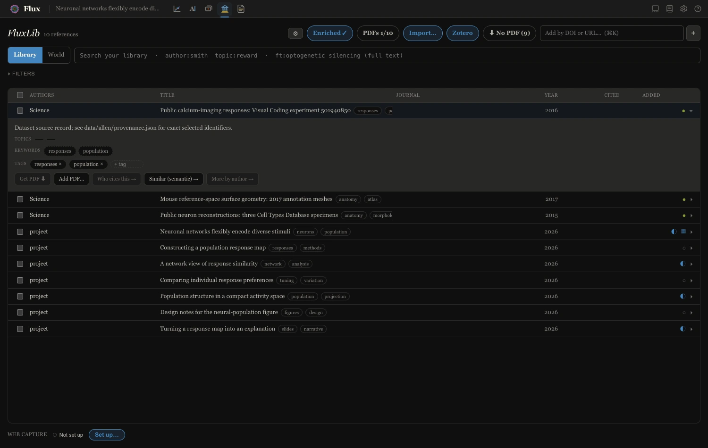
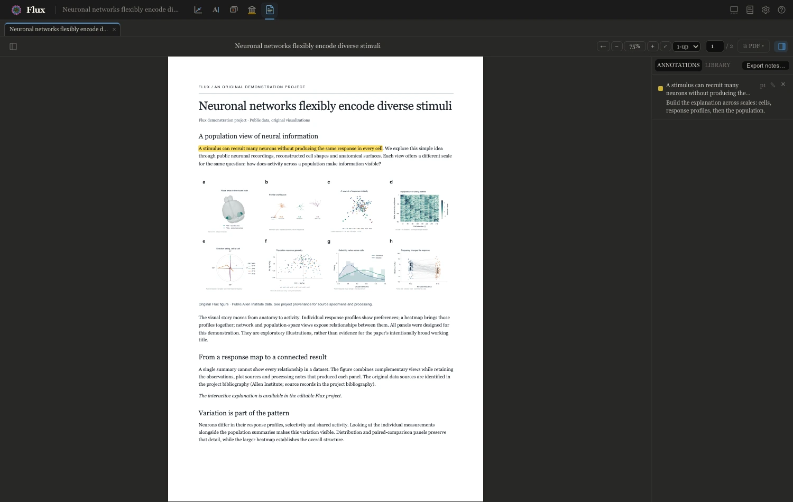

```{=html}
<svg
  class="icon-definitions"
  xmlns="http://www.w3.org/2000/svg"
  aria-hidden="true"
>
  <defs>
    <symbol id="i-arrow" viewBox="0 0 24 24">
      <path d="M4 12h15m-6-6 6 6-6 6" />
    </symbol>
    <symbol id="i-external" viewBox="0 0 24 24">
      <path d="M9 5H5v14h14v-4M12 5h7v7M19 5 9 15" />
    </symbol>
    <symbol id="i-paper" viewBox="0 0 24 24">
      <path d="M6 3h8l4 4v14H6zM14 3v5h4M9 12h6M9 16h6" />
    </symbol>
    <symbol id="i-figure" viewBox="0 0 24 24">
      <path d="M4 4v16h16M7 15l4-5 4 2 5-7M7 5v2" />
    </symbol>
    <symbol id="i-slides" viewBox="0 0 24 24">
      <path d="M3 4h18v12H3zM12 16v5M8 21h8M9 8l5 2-5 3z" />
    </symbol>
    <symbol id="i-library" viewBox="0 0 24 24">
      <path d="M4 4h4v16H4zM11 4h4v16h-4zM18 5l3 14M4 8h4M11 8h4" />
    </symbol>
    <symbol id="i-reader" viewBox="0 0 24 24">
      <path
        d="M12 6C8 3 4 4 2 5v14c3-2 7-2 10 0 3-2 7-2 10 0V5c-2-1-6-2-10 1zm0 0v13"
      />
    </symbol>
    <symbol id="i-zoom" viewBox="0 0 24 24">
      <circle cx="10" cy="10" r="6" />
      <path d="m15 15 6 6M7 10h6M10 7v6" />
    </symbol>
    <symbol id="i-close" viewBox="0 0 24 24">
      <path d="m6 6 12 12M6 18 18 6" />
    </symbol>
    <symbol id="i-menu" viewBox="0 0 24 24">
      <path d="M4 7h16M4 12h16M4 17h16" />
    </symbol>
    <symbol id="i-sun" viewBox="0 0 24 24">
      <circle cx="12" cy="12" r="4" />
      <path
        d="M12 2v2M12 20v2M2 12h2M20 12h2M5 5l1 1M18 18l1 1M5 19l1-1M18 6l1-1"
      />
    </symbol>
    <symbol id="i-folder" viewBox="0 0 24 24">
      <path d="M3 6h7l2 3h9v11H3z" />
    </symbol>
  </defs>
</svg>

<a class="skip-link" href="#main-content">Skip to content</a>
<header class="site-header">
  <div class="header-inner">
    <a class="wordmark" href="/" aria-label="Flux home"
      ><span>Flux</span></a
    >
    <button
      class="menu-toggle"
      type="button"
      aria-expanded="false"
      aria-controls="main-navigation"
    >
      <svg class="icon" aria-hidden="true"><use href="#i-menu" /></svg
      ><span>Menu</span>
    </button>
    <nav
      id="main-navigation"
      class="main-navigation"
      aria-label="Main navigation"
    >
      <a href="#explore">Explore</a>
      <a href="#connected">How it connects</a>
      <a href="https://github.com/fluxsci/flux/blob/main/docs/index.qmd"
        >User guide<svg class="icon external-icon" aria-hidden="true">
          <use href="#i-external" /></svg
      ></a>
    </nav>
    <div class="header-actions">
      <label class="theme-select"
        ><svg class="icon" aria-hidden="true"><use href="#i-sun" /></svg
        ><span class="visually-hidden">Appearance</span
        ><select id="appearance" aria-label="Appearance">
          <option value="system">System</option>
          <option value="light">Light</option>
          <option value="dark">Dark</option>
        </select></label
      >
      <a class="header-start" href="#get-started"
        >Get started<svg class="icon" aria-hidden="true">
          <use href="#i-arrow" /></svg
      ></a>
    </div>
  </div>
</header>

<main id="main-content" class="flux-home">
  <section class="hero" aria-labelledby="hero-title">
    <div class="hero-copy content-width">
      <div class="hero-emblem">
        <div class="emblem-field" aria-hidden="true">
        <svg class="hero-connections" viewBox="0 0 600 120" fill="none">
          <g class="emblem-thread" style="--thread-color:#4385be;--thread-delay:440ms">
            <path d="M258 51C214 51 215 24 164 24H64" pathLength="1" />
            <circle cx="64" cy="24" r="3" />
          </g>
          <g class="emblem-thread" style="--thread-color:#3aa99f;--thread-delay:540ms">
            <path d="M257 66C211 66 208 96 156 96H114" pathLength="1" />
            <circle cx="114" cy="96" r="3" />
          </g>
          <g class="emblem-thread" style="--thread-color:#ce5d97;--thread-delay:640ms">
            <path d="M342 42C382 42 384 18 436 18H503" pathLength="1" />
            <circle cx="503" cy="18" r="3" />
          </g>
          <g class="emblem-thread" style="--thread-color:#8b7ec8;--thread-delay:740ms">
            <path d="M347 61H548" pathLength="1" />
            <circle cx="548" cy="61" r="3" />
          </g>
          <g class="emblem-thread" style="--thread-color:#d0a215;--thread-delay:840ms">
            <path d="M339 80C380 80 376 106 428 106H464" pathLength="1" />
            <circle cx="464" cy="106" r="3" />
          </g>
        </svg>
        <div class="emblem-core">
          <span class="emblem-aura"></span>
      <svg class="hero-mark" viewBox="0 0 100 100" aria-hidden="true">
        <circle cx="46.94" cy="52.8" r="1.39" fill="#d14d41" style="--i:0" />
        <circle cx="50.51" cy="44.15" r="1.42" fill="#da702c" style="--i:1" />
        <circle cx="54.37" cy="55.7" r="1.46" fill="#da702c" style="--i:2" />
        <circle cx="41.83" cy="48.55" r="1.49" fill="#da702c" style="--i:3" />
        <circle cx="57.83" cy="45.02" r="1.53" fill="#da702c" style="--i:4" />
        <circle cx="47.36" cy="59.82" r="1.57" fill="#d0a215" style="--i:5" />
        <circle cx="44.94" cy="40.26" r="1.6" fill="#d0a215" style="--i:6" />
        <circle cx="61.03" cy="54.03" r="1.64" fill="#d0a215" style="--i:7" />
        <circle cx="38.49" cy="54.75" r="1.67" fill="#d0a215" style="--i:8" />
        <circle cx="55.56" cy="38.11" r="1.71" fill="#d0a215" style="--i:9" />
        <circle cx="54.12" cy="63.13" r="1.75" fill="#d0a215" style="--i:10" />
        <circle cx="37.56" cy="42.79" r="1.78" fill="#d0a215" style="--i:11" />
        <circle cx="64.61" cy="46.79" r="1.82" fill="#35ab49" style="--i:12" />
        <circle cx="41.07" cy="62.7" r="1.85" fill="#35ab49" style="--i:13" />
        <circle cx="47.94" cy="34.06" r="1.89" fill="#35ab49" style="--i:14" />
        <circle cx="62.69" cy="60.7" r="1.93" fill="#35ab49" style="--i:15" />
        <circle cx="32.9" cy="50.71" r="1.96" fill="#35ab49" style="--i:16" />
        <circle cx="62.48" cy="37.58" r="2" fill="#35ab49" style="--i:17" />
        <circle cx="49.16" cy="68.07" r="2.03" fill="#35ab49" style="--i:18" />
        <circle cx="38.11" cy="35.75" r="2.07" fill="#35ab49" style="--i:19" />
        <circle cx="68.85" cy="52.54" r="2.11" fill="#35ab49" style="--i:20" />
        <circle cx="34.02" cy="61.12" r="2.14" fill="#35ab49" style="--i:21" />
        <circle cx="54.37" cy="30.58" r="2.18" fill="#3aa99f" style="--i:22" />
        <circle cx="60.11" cy="67.64" r="2.21" fill="#3aa99f" style="--i:23" />
        <circle cx="30.23" cy="43.69" r="2.25" fill="#3aa99f" style="--i:24" />
        <circle cx="69.21" cy="41.13" r="2.29" fill="#3aa99f" style="--i:25" />
        <circle cx="41.67" cy="69.89" r="2.32" fill="#3aa99f" style="--i:26" />
        <circle cx="42.57" cy="29.34" r="2.36" fill="#3aa99f" style="--i:27" />
        <circle cx="69.78" cy="60.4" r="2.39" fill="#3aa99f" style="--i:28" />
        <circle cx="28.02" cy="55.79" r="2.43" fill="#3aa99f" style="--i:29" />
        <circle cx="62.5" cy="30.57" r="2.47" fill="#3aa99f" style="--i:30" />
        <circle cx="53.97" cy="73.14" r="2.5" fill="#3aa99f" style="--i:31" />
        <circle cx="31.15" cy="35.4" r="2.54" fill="#3aa99f" style="--i:32" />
        <circle cx="74.12" cy="48.01" r="2.57" fill="#3aa99f" style="--i:33" />
        <circle cx="33.32" cy="68.02" r="2.61" fill="#3aa99f" style="--i:34" />
        <circle cx="50.13" cy="25.1" r="2.65" fill="#4385be" style="--i:35" />
        <circle cx="66.96" cy="68.7" r="2.68" fill="#4385be" style="--i:36" />
        <circle cx="24.53" cy="47.64" r="2.72" fill="#4385be" style="--i:37" />
        <circle cx="70.65" cy="34.34" r="2.75" fill="#4385be" style="--i:38" />
        <circle cx="45.3" cy="75.82" r="2.79" fill="#4385be" style="--i:39" />
        <circle cx="35.85" cy="27.51" r="2.83" fill="#4385be" style="--i:40" />
        <circle cx="75.94" cy="57.11" r="2.86" fill="#4385be" style="--i:41" />
        <circle cx="25.79" cy="62.42" r="2.9" fill="#4385be" style="--i:42" />
        <circle cx="59.57" cy="24.19" r="2.93" fill="#4385be" style="--i:43" />
        <circle cx="60.49" cy="75.79" r="2.97" fill="#4385be" style="--i:44" />
        <circle cx="24.57" cy="37.94" r="3.01" fill="#4385be" style="--i:45" />
        <circle cx="77.19" cy="41.62" r="3.04" fill="#4385be" style="--i:46" />
        <circle cx="35.46" cy="74.8" r="3.08" fill="#4385be" style="--i:47" />
        <circle cx="43.91" cy="21.6" r="3.11" fill="#4385be" style="--i:48" />
        <circle cx="73.92" cy="67" r="3.15" fill="#4385be" style="--i:49" />
        <circle cx="20.59" cy="53.66" r="3.19" fill="#8b7ec8" style="--i:50" />
        <circle cx="69.4" cy="27.22" r="3.22" fill="#8b7ec8" style="--i:51" />
        <circle cx="51.09" cy="80.19" r="3.26" fill="#8b7ec8" style="--i:52" />
        <circle cx="28.6" cy="28.27" r="3.29" fill="#8b7ec8" style="--i:53" />
        <circle cx="80.74" cy="51.58" r="3.33" fill="#8b7ec8" style="--i:54" />
        <circle cx="26.05" cy="69.78" r="3.37" fill="#8b7ec8" style="--i:55" />
        <circle cx="54.34" cy="18.97" r="3.4" fill="#8b7ec8" style="--i:56" />
        <circle cx="67.92" cy="76.04" r="3.44" fill="#8b7ec8" style="--i:57" />
        <circle cx="18.94" cy="42.84" r="3.47" fill="#8b7ec8" style="--i:58" />
        <circle cx="77.97" cy="34.16" r="3.51" fill="#8b7ec8" style="--i:59" />
        <circle cx="39.99" cy="80.83" r="3.55" fill="#8b7ec8" style="--i:60" />
        <circle cx="36.45" cy="20.27" r="3.58" fill="#8b7ec8" style="--i:61" />
        <circle cx="80.32" cy="62.87" r="3.62" fill="#8b7ec8" style="--i:62" />
        <circle cx="18.7" cy="61.08" r="3.65" fill="#8b7ec8" style="--i:63" />
        <circle cx="65.72" cy="20.46" r="3.69" fill="#8b7ec8" style="--i:64" />
        <circle cx="58.43" cy="82.64" r="3.73" fill="#8b7ec8" style="--i:65" />
        <circle cx="21.52" cy="31.48" r="3.76" fill="#8b7ec8" style="--i:66" />
        <circle cx="83.76" cy="44.38" r="3.8" fill="#8b7ec8" style="--i:67" />
        <circle cx="28.75" cy="77.15" r="3.83" fill="#8b7ec8" style="--i:68" />
        <circle cx="47.31" cy="15.38" r="3.87" fill="#ce5d97" style="--i:69" />
        <circle cx="75.55" cy="73.88" r="3.91" fill="#ce5d97" style="--i:70" />
        <circle cx="14.79" cy="49.65" r="3.94" fill="#ce5d97" style="--i:71" />
        <circle cx="76.38" cy="26.31" r="3.98" fill="#ce5d97" style="--i:72" />
        <circle cx="46.52" cy="85.53" r="4.01" fill="#ce5d97" style="--i:73" />
        <circle cx="28.42" cy="21.26" r="4.05" fill="#ce5d97" style="--i:74" />
        <circle cx="85.56" cy="56.66" r="4.09" fill="#ce5d97" style="--i:75" />
        <circle cx="19.08" cy="69.24" r="4.12" fill="#ce5d97" style="--i:76" />
        <circle cx="59.87" cy="14.7" r="4.16" fill="#ce5d97" style="--i:77" />
        <circle cx="66.67" cy="82.9" r="4.19" fill="#ce5d97" style="--i:78" />
        <circle cx="15.26" cy="36.92" r="4.23" fill="#ce5d97" style="--i:79" />
        <circle cx="84.67" cy="36.1" r="4.27" fill="#ce5d97" style="--i:80" />
        <circle cx="33.73" cy="83.87" r="4.3" fill="#ce5d97" style="--i:81" />
        <circle cx="39.05" cy="13.81" r="4.34" fill="#ce5d97" style="--i:82" />
        <circle cx="82.71" cy="69.4" r="4.37" fill="#ce5d97" style="--i:83" />
        <circle cx="12.55" cy="57.84" r="4.41" fill="#ce5d97" style="--i:84" />
        <circle cx="72.45" cy="18.74" r="4.45" fill="#ce5d97" style="--i:85" />
        <circle cx="54.59" cy="88.44" r="4.48" fill="#ce5d97" style="--i:86" />
        <circle cx="20.49" cy="24.61" r="4.52" fill="#ce5d97" style="--i:87" />
      </svg>
        </div>
        </div>
        <button class="emblem-motion" type="button" aria-label="Pause logo motion" title="Pause logo motion" hidden>
          <svg viewBox="0 0 20 20" aria-hidden="true">
            <path class="motion-pause" d="M7 5v10M13 5v10" />
            <path class="motion-play" d="m7 5 8 5-8 5z" />
          </svg>
        </button>
      </div>
      <h1 id="hero-title" class="intro-rise" style="--intro-delay: 100ms">
        A unified<br /><em>scientific workspace.</em>
      </h1>
      <p class="hero-description intro-rise" style="--intro-delay: 200ms">
        Figures, presentations, literature, and papers.<br class="desktop-break" />
        Connected in one place. Built for you and your AI collaborators.
      </p>
      <div class="hero-actions intro-rise" style="--intro-delay: 300ms">
        <a
          class="button button-primary"
          href="https://github.com/fluxsci/flux/blob/main/docs/installation.qmd"
          >Get started with Flux<svg class="icon" aria-hidden="true">
            <use href="#i-arrow" /></svg></a
        ><a class="text-link" href="#explore"
          >Take a closer look<span aria-hidden="true">↓</span></a
        >
      </div>
    </div>
    <figure id="explore" class="hero-figure wide-width intro-rise" style="--intro-delay: 420ms" data-workspace-preview>
      <div class="figure-overline">
        <span><span class="status-dot"></span>One project. Every part of the work.</span
        ><span class="workspace-prompt">Explore the workspace</span>
      </div>
      <div class="workspace-choices" role="group" aria-label="Choose a Flux workspace" hidden>
        <button type="button" data-workspace="paper" aria-pressed="true" style="--workspace-color:#4385be"><svg class="icon" aria-hidden="true"><use href="#i-paper" /></svg>Paper<span>Write &amp; publish</span></button>
        <button type="button" data-workspace="figure" aria-pressed="false" style="--workspace-color:#3aa99f"><svg class="icon" aria-hidden="true"><use href="#i-figure" /></svg>Figure<span>Compose &amp; refine</span></button>
        <button type="button" data-workspace="slides" aria-pressed="false" style="--workspace-color:#ce5d97"><svg class="icon" aria-hidden="true"><use href="#i-slides" /></svg>Slides<span>Build the explanation</span></button>
        <button type="button" data-workspace="library" aria-pressed="false" style="--workspace-color:#8b7ec8"><svg class="icon" aria-hidden="true"><use href="#i-library" /></svg>Library<span>Collect &amp; connect</span></button>
        <button type="button" data-workspace="reader" aria-pressed="false" style="--workspace-color:#d0a215"><svg class="icon" aria-hidden="true"><use href="#i-reader" /></svg>Reader<span>Read &amp; understand</span></button>
      </div>
      <a
        class="media-enlarge hero-image"
        href="assets/media/paper.webp"
        data-enlarge
        data-caption="Paper in Flux: the example manuscript, with its figures and references in view."
        aria-label="Enlarge the Flux Paper workspace"
        ><span class="zoom-hint"
          ><svg class="icon" aria-hidden="true"><use href="#i-zoom" /></svg>View
          workspace</span
        ></a
      >
      <figcaption>
        <span data-workspace-caption aria-live="polite">Write with your figures, citations, and working notes in reach.</span>
        <a class="text-link workspace-guide" href="#paper" data-workspace-guide>Explore Paper<span aria-hidden="true">↓</span></a>
      </figcaption>
    </figure>
    <nav
      class="module-navigation content-width intro-rise"
      style="--intro-delay: 780ms"
      aria-label="Explore the five modules"
    >
      <a href="#paper"
        ><svg class="icon" aria-hidden="true"><use href="#i-paper" /></svg
        >Paper<span>01</span></a
      >
      <a href="#figure"
        ><svg class="icon" aria-hidden="true"><use href="#i-figure" /></svg
        >Figure<span>02</span></a
      >
      <a href="#slides"
        ><svg class="icon" aria-hidden="true"><use href="#i-slides" /></svg
        >Slides<span>03</span></a
      >
      <a href="#library"
        ><svg class="icon" aria-hidden="true"><use href="#i-library" /></svg
        >Library<span>04</span></a
      >
      <a href="#reader"
        ><svg class="icon" aria-hidden="true"><use href="#i-reader" /></svg
        >Reader<span>05</span></a
      >
    </nav>
  </section>

  <section
    id="paper"
    class="module-section paper-section content-width section-space"
    aria-labelledby="paper-title"
  >
    <div class="module-heading">
      <p class="module-label">
        <svg class="icon" aria-hidden="true"><use href="#i-paper" /></svg>01 /
        Paper
      </p>
      <h2 id="paper-title">Room to think.<br />Tools to write.</h2>
    </div>
    <div class="module-copy">
      <p>
        From working notes to the final manuscript, write on a clean surface
        that keeps citations, figures, equations, and review close at hand.
        Underneath, your document stays an ordinary Quarto file.
      </p>
      <ul class="feature-list">
        <li>Cite from your library as you write.</li>
        <li>Keep figures and their references connected.</li>
        <li>Review in the margin; export to HTML, PDF, or Word.</li>
      </ul>
      <a
        class="text-link"
        href="https://github.com/fluxsci/flux/blob/main/docs/modes/paper.qmd"
        >Explore the writing guide<svg class="icon" aria-hidden="true">
          <use href="#i-arrow" /></svg
      ></a>
    </div>
    <figure class="module-visual" data-reveal>
      <a
        class="media-enlarge"
        href="assets/media/paper-detail.webp"
        data-enlarge
        data-caption="A close view of Paper: prose, a figure reference, the composed figure, and its caption stay together."
        aria-label="Enlarge the Paper screenshot"
        ><span class="zoom-hint"
          ><svg class="icon" aria-hidden="true"><use href="#i-zoom" /></svg
          >Enlarge</span
        ></a
      >
      <figcaption>
        <span class="caption-index">01</span>A manuscript with the evidence in
        view.<span class="caption-note">The source remains yours.</span>
      </figcaption>
    </figure>
  </section>

  <div class="dark-studio">
    <section
      id="figure"
      class="module-section content-width section-space"
      aria-labelledby="figure-title"
    >
      <div class="module-heading">
        <p class="module-label">
          <svg class="icon" aria-hidden="true"><use href="#i-figure" /></svg>02
          / Figure
        </p>
        <h2 id="figure-title">A figure is more<br />than an image.</h2>
      </div>
      <div class="module-copy">
        <p>
          Compose publication figures on a precise, open canvas. With plots made
          by fluxplot, the lines, labels, and series remain meaningful parts you
          can select and refine.
        </p>
        <ul class="feature-list">
          <li>Arrange panels at their physical publication size.</li>
          <li>Style individual plot parts without rerunning the analysis.</li>
          <li>Keep those styling choices when a linked source updates.</li>
        </ul>
        <a
          class="text-link"
          href="https://github.com/fluxsci/flux/blob/main/docs/modes/figure.qmd"
          >Explore the figure guide<svg class="icon" aria-hidden="true">
            <use href="#i-arrow" /></svg
        ></a>
      </div>
      <figure class="module-visual" data-reveal>
        <a
          class="media-enlarge"
          href="assets/media/figure.webp"
          data-enlarge
          data-caption="A real Figure workspace. Semantic plots retain named, editable parts alongside the composed layout."
          aria-label="Enlarge the Figure screenshot"
          ><span class="zoom-hint"
            ><svg class="icon" aria-hidden="true"><use href="#i-zoom" /></svg
            >Explore the detail</span
          ></a
        >
        <figcaption>
          <span class="caption-index">02</span>The whole composition, down to
          the individual part.<span class="caption-note"
            >Composed in Flux · Public neuroscience data.</span
          >
        </figcaption>
      </figure>
      <div
        class="xray"
        id="semantic-plot"
        data-xray
        data-figure="fig-neural-structure"
        data-initial="1"
        data-states="1 Hz|assets/media/xray/tuning-landscape-1hz.svg|plots/advanced/16-tuning-landscape-1hz.svg;2 Hz|assets/media/xray/tuning-landscape-2hz.svg|plots/advanced/16-tuning-landscape-2hz.svg;4 Hz|assets/media/xray/tuning-landscape-4hz.svg|plots/advanced/16-tuning-landscape-4hz.svg"
        data-reveal
      >
        <div class="xray-stage-wrap">
          <div class="xray-topline">
            <span
              ><span class="status-dot"></span>Try it: one plot, every part editable</span
            ><code data-xray-file>plots/advanced/16-tuning-landscape-2hz.svg</code>
          </div>
          <div class="xray-stage" data-xray-stage>
            
          </div>
          <div
            class="xray-states"
            role="group"
            aria-label="Regenerate the plot at another temporal frequency"
          >
            <span class="xray-states-label">Rerun the analysis at</span>
            <button type="button" data-xray-state="0" aria-pressed="false">1 Hz</button>
            <button type="button" data-xray-state="1" aria-pressed="true">2 Hz</button>
            <button type="button" data-xray-state="2" aria-pressed="false">4 Hz</button>
          </div>
        </div>
        <aside class="xray-panel" aria-label="X-ray of the plot">
          <p class="xray-panel-label">X-ray</p>
          <div class="xray-readout" data-xray-readout aria-live="polite">
            <p class="xray-hint">
              Every curve, point, tick and title in this file carries a stable
              name. With scripts on, move over the plot to read them.
            </p>
          </div>
          <ul class="xray-parts" data-xray-parts aria-label="Named series in this plot"></ul>
          <div class="xray-command">
            <span class="xray-command-label">The same name, from the terminal</span
            ><code data-xray-command
              >flux restyle fig-neural-structure cell-587375741-guide.line --stroke '#205ea6'</code
            >
          </div>
        </aside>
        <p class="xray-caption">
          Select a curve to change its color, then choose another frequency.
          The data change; your styling stays. This is a real plot from the
          <a href="#example-project">downloadable example project</a>.
        </p>
      </div>
      <figure class="science-plate module-visual" data-reveal>
        <a class="media-enlarge" href="assets/media/neural-figure.webp" data-enlarge
          data-caption="Neuronal networks flexibly encode diverse stimuli. An original eleven-panel Flux composition of public Allen Institute data: brain anatomy, reconstructed neurons, a 143-cell response atlas, example cells, population trajectories, similarity structure and tuning statistics. The anatomy and response recordings come from separate datasets."
          aria-label="Enlarge the complete neuroscience figure">
          
          <span class="zoom-hint"><svg class="icon" aria-hidden="true"><use href="#i-zoom" /></svg>Inspect every panel</span>
        </a>
        <figcaption><span class="caption-index">Inside the example</span>
          From anatomy to population activity.<span class="caption-note">One editable composition. Eleven panels, every part named.</span></figcaption>
      </figure>
    </section>

    <section
      id="slides"
      class="slides-section content-width section-space"
      aria-labelledby="slides-title"
    >
      <div class="slides-intro">
        <div>
          <p class="module-label">
            <svg class="icon" aria-hidden="true"><use href="#i-slides" /></svg
            >03 / Slides
          </p>
          <h2 id="slides-title">Give your result<br />a little time.</h2>
        </div>
        <div class="module-copy">
          <p>
            Send a figure to your deck and give it a timeline. Reveal a series,
            draw on network edges, and guide the audience through your result
            one step at a time.
          </p>
          <p>
            Then insert the slide into a document. The explanation stays
            interactive in Paper and HTML; PDF and Word carry the opening still.
          </p>
          <a
            class="text-link"
            href="https://github.com/fluxsci/flux/blob/main/docs/modes/slide.qmd"
            >Explore the slides guide<svg class="icon" aria-hidden="true">
              <use href="#i-arrow" /></svg
          ></a>
        </div>
      </div>
      <div class="slide-demo-wrap" data-reveal>
        <div class="demo-topline">
          <span class="demo-label"
            ><span class="status-dot"></span>A real Flux slide</span
          ><span>Explore it at your own pace</span>
        </div>
        <div
          class="slide-demo"
          id="slide-demo"
          data-demo-src="demos/neural-populations/index.html"
        >
          <button
            type="button"
            class="demo-launch"
            aria-label="Load the interactive neuroscience slides"
            data-demo-start
          >
            <span class="demo-launch-prompt"
              ><span class="play-disc" aria-hidden="true"
                ><svg viewBox="0 0 24 24"><path d="m9 6 9 6-9 6Z" /></svg></span
              ><span
                >Explore the live slides<small
                  >You control the next step.</small
                ></span
              ></span
            >
          </button>
        </div>
        <div class="demo-caption">
          <p>
            <strong>Follow the population.</strong> Choose a scene, then use
            the arrows to reveal its explanation. Four editable slides,
            presented with Flux’s own player.
          </p>
          <a href="demos/neural-populations/index.html" class="text-link"
            >Open on its own<svg class="icon" aria-hidden="true">
              <use href="#i-external" /></svg
          ></a>
        </div>
        <details class="demo-description">
          <summary>Read the demonstration without playing it</summary>
          <p>
            The opening scene introduces responses from a neuronal population.
            Its steps reveal a stimulus-response heatmap, a network connecting
            cells with similar response profiles, and a short interpretation.
            The other scenes explore brain and cell anatomy, stimulus tuning,
            and low-dimensional population activity. All designs and prose
            are original; the underlying data are public Allen Institute data.
            This is an illustrative project, with anatomical context drawn
            from separate specimens and no claim of a new research finding.
          </p>
        </details>
      </div>
      <figure class="slide-authoring" data-reveal>
        <a
          class="media-enlarge"
          href="assets/media/slides.webp"
          data-enlarge
          data-caption="The Slides authoring workspace: compose the scene, then arrange its animation steps."
          aria-label="Enlarge the Slides authoring screenshot"
          ><span class="zoom-hint"
            ><svg class="icon" aria-hidden="true"><use href="#i-zoom" /></svg
            >View the editor</span
          ></a
        >
        <figcaption>
          <span class="eyebrow">Behind the explanation</span>
          <h3>Compose. Sequence. Share.</h3>
          <p>
            Bring a figure into your deck, give it its own layout, and author
            the steps. Reuse the result as an interactive slide inside your
            writing.
          </p>
          <a
            class="text-link"
            href="https://github.com/fluxsci/flux/blob/main/docs/modes/paper.qmd#slides-in-documents"
            >Read about slides in documents<svg class="icon" aria-hidden="true">
              <use href="#i-arrow" /></svg
          ></a>
        </figcaption>
      </figure>
    </section>
  </div>

  <section
    id="library"
    class="module-section content-width section-space"
    aria-labelledby="library-title"
  >
    <div class="module-heading">
      <p class="module-label">
        <svg class="icon" aria-hidden="true"><use href="#i-library" /></svg>04 /
        Library
      </p>
      <h2 id="library-title">A home for the<br />papers you find.</h2>
    </div>
    <div class="module-copy">
      <p>
        Keep a lasting collection across projects. Bring in references and PDFs,
        organize what matters, and find your way back through metadata or the
        text inside a paper.
      </p>
      <ul class="feature-list">
        <li>Collect by DOI, import, web capture, or Zotero.</li>
        <li>Search stored full text and open the matching page.</li>
        <li>Cite into a project without rebuilding your library.</li>
      </ul>
      <a
        class="text-link"
        href="https://github.com/fluxsci/flux/blob/main/docs/modes/library.qmd"
        >Explore the library guide<svg class="icon" aria-hidden="true">
          <use href="#i-arrow" /></svg
      ></a>
    </div>
    <figure class="module-visual" data-reveal>
      <a
        class="media-enlarge"
        href="assets/media/library.webp"
        data-enlarge
        data-caption="The Library brings references, attachments, and organization into one collection across projects."
        aria-label="Enlarge the Library screenshot"
        ><span class="zoom-hint"
          ><svg class="icon" aria-hidden="true"><use href="#i-zoom" /></svg
          >Enlarge</span
        ></a
      >
      <figcaption>
        <span class="caption-index">04</span>One collection, ready for the next
        question.<span class="caption-note"
          >Each project keeps its own cited subset.</span
        >
      </figcaption>
    </figure>
  </section>

  <section
    id="reader"
    class="module-section reader-section content-width section-space"
    aria-labelledby="reader-title"
  >
    <div class="module-heading">
      <p class="module-label">
        <svg class="icon" aria-hidden="true"><use href="#i-reader" /></svg>05 /
        Reader
      </p>
      <h2 id="reader-title">Stay with the idea.<br />Keep the evidence.</h2>
    </div>
    <div class="module-copy">
      <p>
        Read closely without losing your place. Follow a citation, annotate a
        passage, or inspect a figure beside the discussion. Keep the useful
        details connected to where you found them.
      </p>
      <ul class="feature-list">
        <li>Read side by side with split panes and tabs.</li>
        <li>Keep highlights and comments anchored to the paper.</li>
        <li>Capture figure snips with their source provenance.</li>
      </ul>
      <a
        class="text-link"
        href="https://github.com/fluxsci/flux/blob/main/docs/modes/reader.qmd"
        >Explore the reader guide<svg class="icon" aria-hidden="true">
          <use href="#i-arrow" /></svg
      ></a>
    </div>
    <figure class="module-visual" data-reveal>
      <a
        class="media-enlarge"
        href="assets/media/reader.webp"
        data-enlarge
        data-caption="The Reader displays the original neuroscience demonstration manuscript, with reading notes anchored to the text."
        aria-label="Enlarge the Reader screenshot"
        ><span class="zoom-hint"
          ><svg class="icon" aria-hidden="true"><use href="#i-zoom" /></svg
          >Enlarge</span
        ></a
      >
      <figcaption>
        <span class="caption-index">05</span>Read the paper. Follow the
        thread.<span class="caption-note">The source stays in reach.</span>
      </figcaption>
    </figure>
  </section>

  <section
    id="connected"
    class="connected-section section-space"
    aria-labelledby="connected-title"
  >
    <div class="content-width">
      <div class="connected-heading">
        <p class="eyebrow">Connected by design</p>
        <h2 id="connected-title">
          The work keeps moving.<br /><em>The connections stay.</em>
        </h2>
        <p>
          Five perspectives on one project. Move an idea from the literature
          into a figure, a manuscript, and a talk.
        </p>
      </div>
      <div data-reveal
        class="connection-paths"
        aria-label="Connections between Flux modules"
      >
        <div>
          <span class="connection-source"
            ><svg class="icon" aria-hidden="true"><use href="#i-library" /></svg
            >Library</span
          ><span class="connection-arrow"
            ><span>Cite a reference</span
            ><svg class="icon" aria-hidden="true">
              <use href="#i-arrow" /></svg></span
          ><span class="connection-destination">Paper</span>
          <p>The citation enters your document and its project bibliography.</p>
        </div>
        <div>
          <span class="connection-source"
            ><svg class="icon" aria-hidden="true"><use href="#i-figure" /></svg
            >Figure</span
          ><span class="connection-arrow"
            ><span>Reference a figure</span
            ><svg class="icon" aria-hidden="true">
              <use href="#i-arrow" /></svg></span
          ><span class="connection-destination">Paper</span>
          <p>A stable reference keeps the manuscript attached to its figure.</p>
        </div>
        <div>
          <span class="connection-source"
            ><svg class="icon" aria-hidden="true"><use href="#i-slides" /></svg
            >Slides</span
          ><span class="connection-arrow"
            ><span>Embed a slide</span
            ><svg class="icon" aria-hidden="true">
              <use href="#i-arrow" /></svg></span
          ><span class="connection-destination">Paper</span>
          <p>
            Saved slide edits refresh the document; HTML preserves the steps.
          </p>
        </div>
      </div>
      <div id="projects" class="project-story" data-reveal>
        <div class="project-copy">
          <p class="eyebrow">A project is a folder</p>
          <h3>Familiar files.<br />Lasting work.</h3>
          <p>
            Your documents, plots, references, and context live in a project you
            can inspect. Flux’s compositions use readable files, and generated
            exports stay separate from their sources.
          </p>
          <a
            class="text-link"
            href="https://github.com/fluxsci/flux/blob/main/docs/concepts/projects-and-files.qmd"
            >Understand the project model<svg class="icon" aria-hidden="true">
              <use href="#i-arrow" /></svg
          ></a>
        </div>
        <div
          class="project-tree"
          role="img"
          aria-label="A Flux project folder contains paper documents, source plots, figure compositions, slide decks, references, project context, and generated exports."
        >
          <div class="tree-heading">
            <svg class="icon" aria-hidden="true"><use href="#i-folder" /></svg
            ><span>neural-populations/</span
            ><span class="tree-label">Your project</span>
          </div>
          <ul>
            <li>
              <code>paper/</code><span>Documents &amp; working notes</span>
            </li>
            <li><code>plots/</code><span>Plots from your analysis</span></li>
            <li><code>fig/</code><span>Figure compositions</span></li>
            <li>
              <code>slides/</code><span>Decks &amp; animation steps</span>
            </li>
            <li>
              <code>references/</code><span>The project bibliography</span>
            </li>
            <li>
              <code>Context/</code><span>Mission, notebook &amp; rules</span>
            </li>
            <li class="tree-derived">
              <code>exports/</code><span>Generated output</span>
            </li>
          </ul>
          <p>The example behind this page. Yours to explore.</p>
        </div>
      </div>
      <div class="example-download" id="example-project">
        <div>
          <p class="eyebrow">Open the work behind the website</p>
          <h3>Meet the example project.</h3>
          <p><em>Neuronal networks flexibly encode diverse stimuli.</em>
            A complete Flux project with the manuscript, thirty-three source
            plots, two composed figures, four animated slides, and public data. Download it, unzip it,
            and open the <code>neural-populations</code> folder in Flux.</p>
        </div>
        <a class="button button-primary" href="downloads/neural-populations.zip" download>
          Download the Flux project<svg class="icon" aria-hidden="true"><use href="#i-arrow" /></svg></a>
      </div>
    </div>
  </section>

  <section
    id="fluxconfig"
    class="config-section content-width section-space"
    aria-labelledby="config-title"
  >
    <div class="config-copy">
      <p class="eyebrow">FluxConfig</p>
      <h2 id="config-title">Your way of working.<br />Across projects.</h2>
      <p>
        Your library, reusable styles, and working context have a home of their
        own. FluxConfig brings that personal environment to every project, while
        each project keeps its own research and history.
      </p>
      <a
        class="text-link"
        href="https://github.com/fluxsci/flux/blob/main/docs/concepts/library-and-fluxlib.qmd"
        >Read about your library and configuration<svg
          class="icon"
          aria-hidden="true"
        >
          <use href="#i-arrow" /></svg
      ></a>
    </div>
    <div data-reveal
      class="config-diagram"
      aria-label="FluxConfig contains your shared library, context, and reusable presets. Individual projects keep their own files and context."
    >
      <div class="config-hub">
        
        <div>
          <span class="eyebrow">Your research environment</span
          ><strong>FluxConfig</strong>
        </div>
      </div>
      <div class="config-contents">
        <div>
          <span>01</span><strong>FluxLib</strong
          ><small>Your library &amp; attachments</small>
        </div>
        <div>
          <span>02</span><strong>Context</strong
          ><small>Guidance &amp; working context</small>
        </div>
        <div>
          <span>03</span><strong>Presets</strong
          ><small>Reusable design choices</small>
        </div>
      </div>
      <div class="config-connector" aria-hidden="true"></div>
      <div class="config-projects">
        <div>
          <svg class="icon" aria-hidden="true"><use href="#i-folder" /></svg
          ><span>Neural populations<small>Files · context · citations</small></span>
        </div>
        <div>
          <svg class="icon" aria-hidden="true"><use href="#i-folder" /></svg
          ><span
            >Your next project<small>Files · context · citations</small></span
          >
        </div>
      </div>
      <p class="diagram-caption">
        One personal environment. Independent project folders.
      </p>
    </div>
  </section>

  <section
    id="agents"
    class="agent-section section-space"
    aria-labelledby="agents-title"
  >
    <div class="content-width">
      <div class="agent-heading">
        <div>
          <p class="eyebrow">AI, with context</p>
          <h2 id="agents-title">
            A collaborator who can<br />pick up the thread.
          </h2>
        </div>
        <div class="module-copy">
          <p>
            An agent can read your project’s mission, working notes, and rules,
            then work with the same figures, slides, and files you use. Ask it
            to restyle a series or animate a plot, and review the result in
            your workspace.
          </p>
          <p>
            You choose whether to bring an agent into the work, and which
            supported agent to use.
          </p>
        </div>
      </div>
      <ol class="agent-loop" data-reveal>
        <li>
          <span class="agent-step">01</span>
          <h3>Set the direction.</h3>
          <p>
            The mission describes the question. The notebook carries decisions
            forward. Rules preserve what matters to you.
          </p>
          <div class="context-tags">
            <span>Mission</span><span>Notebook</span><span>Rules</span>
          </div>
        </li>
        <li>
          <span class="agent-step">02</span>
          <h3>Work alongside it.</h3>
          <p>
            Launch a principal agent in your terminal. It reads the project
            context and uses the available Flux tools.
          </p>
          <div class="terminal-command">
            <span aria-hidden="true">$</span><code>flux principal</code>
          </div>
        </li>
        <li>
          <span class="agent-step">03</span>
          <h3>Review where you are.</h3>
          <p>
            Comment on a passage or leave feedback on a figure. Keep the request
            connected to the work it concerns.
          </p>
          <a
            class="text-link"
            href="https://github.com/fluxsci/flux/blob/main/docs/agents/collaboration.qmd"
            >Explore agent collaboration<svg class="icon" aria-hidden="true">
              <use href="#i-arrow" /></svg
          ></a>
        </li>
      </ol>
    </div>
  </section>

  <section
    id="get-started"
    class="closing-section content-width section-space"
    aria-labelledby="closing-title"
  >
    
    <p class="eyebrow">Make room for the next idea</p>
    <h2 id="closing-title">Your research.<br /><em>In Flux.</em></h2>
    <p>
      Start with the installation guide, open a project,<br
        class="desktop-break"
      />
      and find your own way through the studio.
    </p>
    <div class="closing-actions">
      <a
        class="button button-primary"
        href="https://github.com/fluxsci/flux/blob/main/docs/installation.qmd"
        >Get started with Flux<svg class="icon" aria-hidden="true">
          <use href="#i-arrow" /></svg></a
      ><a class="button button-secondary" href="https://github.com/fluxsci/flux"
        >View on GitHub<svg class="icon" aria-hidden="true">
          <use href="#i-external" /></svg
      ></a>
    </div>
  </section>
</main>

<footer class="site-footer">
  <div class="content-width">
    <div class="footer-top">
      <a class="wordmark" href="/" aria-label="Flux home"
        ><span>Flux</span></a
      >
      <p>A unified scientific workspace.</p>
      <nav aria-label="Footer navigation">
        <a href="https://github.com/fluxsci/flux/blob/main/docs/index.qmd"
          >User guide</a
        ><a
          href="https://github.com/fluxsci/flux/blob/main/docs/reference/shortcuts.qmd"
          >Shortcuts</a
        ><a href="https://github.com/fluxsci/flux"
          >GitHub<svg class="icon external-icon" aria-hidden="true">
            <use href="#i-external" /></svg
        ></a>
      </nav>
    </div>
    <div class="footer-bottom">
      <span>Built around the work. Built around you.</span
      ><span>Original demo content · Public neuroscience data</span
      ><a href="#main-content">Back to top ↑</a>
    </div>
    <p class="data-credit">Example data: Allen Institute,
      <a href="https://brain-map.org/our-research/circuits-behavior/visual-coding">Visual Coding</a>,
      <a href="https://celltypes.brain-map.org/">Cell Types Database</a>, and
      <a href="https://download.alleninstitute.org/informatics-archive/current-release/mouse_ccf/">Common Coordinate Framework</a>.
      Original visualizations and writing for Flux. Dataset attribution and
      <a href="https://alleninstitute.org/legal/terms-of-use">noncommercial use terms</a>
      are included in the project.</p>
  </div>
</footer>

<dialog
  class="media-dialog"
  id="media-dialog"
  aria-labelledby="media-dialog-caption"
>
  <div class="media-dialog-inner">
    <button
      class="dialog-close"
      type="button"
      aria-label="Close enlarged image"
    >
      <span>Close</span
      ><svg class="icon" aria-hidden="true">
        <use href="#i-close" />
      </svg></button
    >
    <p id="media-dialog-caption"></p>
  </div>
</dialog>
```
