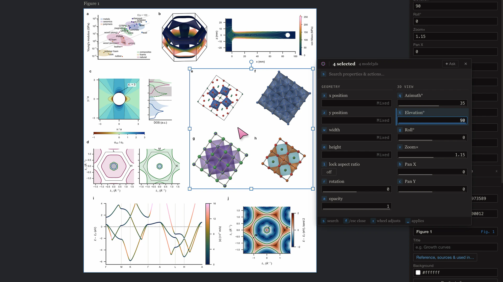
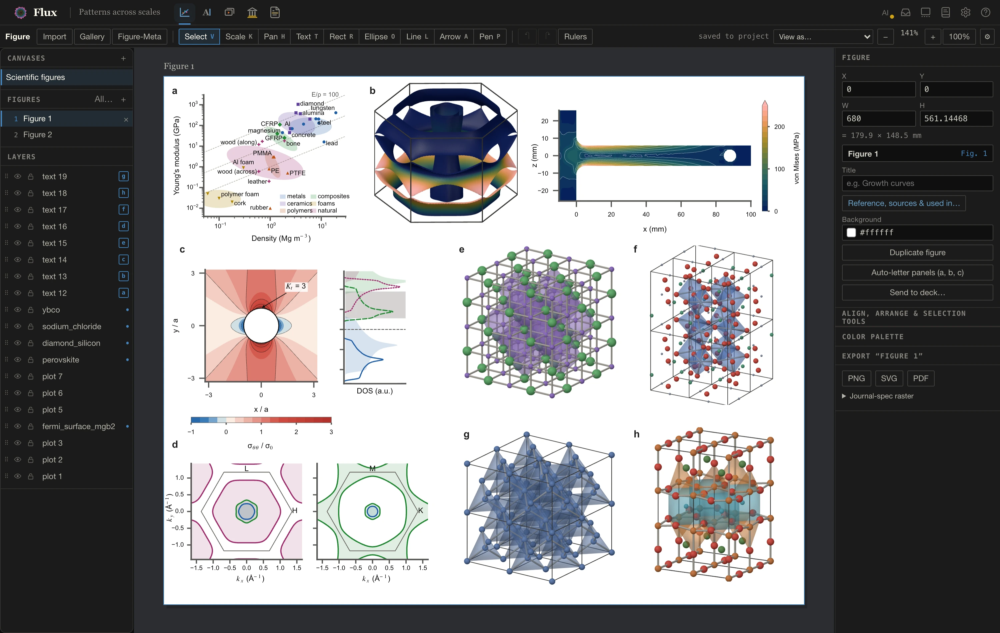

```{=html}
<svg
  class="icon-definitions"
  xmlns="http://www.w3.org/2000/svg"
  aria-hidden="true"
>
  <defs>
    <symbol id="i-arrow" viewBox="0 0 24 24">
      <path d="M4 12h15m-6-6 6 6-6 6" />
    </symbol>
    <symbol id="i-external" viewBox="0 0 24 24">
      <path d="M9 5H5v14h14v-4M12 5h7v7M19 5 9 15" />
    </symbol>
    <symbol id="i-paper" viewBox="0 0 24 24">
      <path d="M6 3h8l4 4v14H6zM14 3v5h4M9 12h6M9 16h6" />
    </symbol>
    <symbol id="i-figure" viewBox="0 0 24 24">
      <path d="M4 4v16h16M7 15l4-5 4 2 5-7M7 5v2" />
    </symbol>
    <symbol id="i-slides" viewBox="0 0 24 24">
      <path d="M3 4h18v12H3zM12 16v5M8 21h8M9 8l5 2-5 3z" />
    </symbol>
    <symbol id="i-library" viewBox="0 0 24 24">
      <path d="M4 4h4v16H4zM11 4h4v16h-4zM18 5l3 14M4 8h4M11 8h4" />
    </symbol>
    <symbol id="i-reader" viewBox="0 0 24 24">
      <path
        d="M12 6C8 3 4 4 2 5v14c3-2 7-2 10 0 3-2 7-2 10 0V5c-2-1-6-2-10 1zm0 0v13"
      />
    </symbol>
    <symbol id="i-zoom" viewBox="0 0 24 24">
      <circle cx="10" cy="10" r="6" />
      <path d="m15 15 6 6M7 10h6M10 7v6" />
    </symbol>
    <symbol id="i-close" viewBox="0 0 24 24">
      <path d="m6 6 12 12M6 18 18 6" />
    </symbol>
    <symbol id="i-menu" viewBox="0 0 24 24">
      <path d="M4 7h16M4 12h16M4 17h16" />
    </symbol>
    <symbol id="i-sun" viewBox="0 0 24 24">
      <circle cx="12" cy="12" r="4" />
      <path
        d="M12 2v2M12 20v2M2 12h2M20 12h2M5 5l1 1M18 18l1 1M5 19l1-1M18 6l1-1"
      />
    </symbol>
    <symbol id="i-folder" viewBox="0 0 24 24">
      <path d="M3 6h7l2 3h9v11H3z" />
    </symbol>
  </defs>
</svg>

<main id="main-content" class="flux-home">
  <section class="hero" aria-labelledby="hero-title">
    <div class="hero-copy content-width">
      <svg class="hero-mark" viewBox="0 0 100 100" aria-hidden="true">
        <circle cx="46.94" cy="52.8" r="1.39" fill="#d14d41" style="--i:0" />
        <circle cx="50.51" cy="44.15" r="1.42" fill="#da702c" style="--i:1" />
        <circle cx="54.37" cy="55.7" r="1.46" fill="#da702c" style="--i:2" />
        <circle cx="41.83" cy="48.55" r="1.49" fill="#da702c" style="--i:3" />
        <circle cx="57.83" cy="45.02" r="1.53" fill="#da702c" style="--i:4" />
        <circle cx="47.36" cy="59.82" r="1.57" fill="#d0a215" style="--i:5" />
        <circle cx="44.94" cy="40.26" r="1.6" fill="#d0a215" style="--i:6" />
        <circle cx="61.03" cy="54.03" r="1.64" fill="#d0a215" style="--i:7" />
        <circle cx="38.49" cy="54.75" r="1.67" fill="#d0a215" style="--i:8" />
        <circle cx="55.56" cy="38.11" r="1.71" fill="#d0a215" style="--i:9" />
        <circle cx="54.12" cy="63.13" r="1.75" fill="#d0a215" style="--i:10" />
        <circle cx="37.56" cy="42.79" r="1.78" fill="#d0a215" style="--i:11" />
        <circle cx="64.61" cy="46.79" r="1.82" fill="#35ab49" style="--i:12" />
        <circle cx="41.07" cy="62.7" r="1.85" fill="#35ab49" style="--i:13" />
        <circle cx="47.94" cy="34.06" r="1.89" fill="#35ab49" style="--i:14" />
        <circle cx="62.69" cy="60.7" r="1.93" fill="#35ab49" style="--i:15" />
        <circle cx="32.9" cy="50.71" r="1.96" fill="#35ab49" style="--i:16" />
        <circle cx="62.48" cy="37.58" r="2" fill="#35ab49" style="--i:17" />
        <circle cx="49.16" cy="68.07" r="2.03" fill="#35ab49" style="--i:18" />
        <circle cx="38.11" cy="35.75" r="2.07" fill="#35ab49" style="--i:19" />
        <circle cx="68.85" cy="52.54" r="2.11" fill="#35ab49" style="--i:20" />
        <circle cx="34.02" cy="61.12" r="2.14" fill="#35ab49" style="--i:21" />
        <circle cx="54.37" cy="30.58" r="2.18" fill="#3aa99f" style="--i:22" />
        <circle cx="60.11" cy="67.64" r="2.21" fill="#3aa99f" style="--i:23" />
        <circle cx="30.23" cy="43.69" r="2.25" fill="#3aa99f" style="--i:24" />
        <circle cx="69.21" cy="41.13" r="2.29" fill="#3aa99f" style="--i:25" />
        <circle cx="41.67" cy="69.89" r="2.32" fill="#3aa99f" style="--i:26" />
        <circle cx="42.57" cy="29.34" r="2.36" fill="#3aa99f" style="--i:27" />
        <circle cx="69.78" cy="60.4" r="2.39" fill="#3aa99f" style="--i:28" />
        <circle cx="28.02" cy="55.79" r="2.43" fill="#3aa99f" style="--i:29" />
        <circle cx="62.5" cy="30.57" r="2.47" fill="#3aa99f" style="--i:30" />
        <circle cx="53.97" cy="73.14" r="2.5" fill="#3aa99f" style="--i:31" />
        <circle cx="31.15" cy="35.4" r="2.54" fill="#3aa99f" style="--i:32" />
        <circle cx="74.12" cy="48.01" r="2.57" fill="#3aa99f" style="--i:33" />
        <circle cx="33.32" cy="68.02" r="2.61" fill="#3aa99f" style="--i:34" />
        <circle cx="50.13" cy="25.1" r="2.65" fill="#4385be" style="--i:35" />
        <circle cx="66.96" cy="68.7" r="2.68" fill="#4385be" style="--i:36" />
        <circle cx="24.53" cy="47.64" r="2.72" fill="#4385be" style="--i:37" />
        <circle cx="70.65" cy="34.34" r="2.75" fill="#4385be" style="--i:38" />
        <circle cx="45.3" cy="75.82" r="2.79" fill="#4385be" style="--i:39" />
        <circle cx="35.85" cy="27.51" r="2.83" fill="#4385be" style="--i:40" />
        <circle cx="75.94" cy="57.11" r="2.86" fill="#4385be" style="--i:41" />
        <circle cx="25.79" cy="62.42" r="2.9" fill="#4385be" style="--i:42" />
        <circle cx="59.57" cy="24.19" r="2.93" fill="#4385be" style="--i:43" />
        <circle cx="60.49" cy="75.79" r="2.97" fill="#4385be" style="--i:44" />
        <circle cx="24.57" cy="37.94" r="3.01" fill="#4385be" style="--i:45" />
        <circle cx="77.19" cy="41.62" r="3.04" fill="#4385be" style="--i:46" />
        <circle cx="35.46" cy="74.8" r="3.08" fill="#4385be" style="--i:47" />
        <circle cx="43.91" cy="21.6" r="3.11" fill="#4385be" style="--i:48" />
        <circle cx="73.92" cy="67" r="3.15" fill="#4385be" style="--i:49" />
        <circle cx="20.59" cy="53.66" r="3.19" fill="#8b7ec8" style="--i:50" />
        <circle cx="69.4" cy="27.22" r="3.22" fill="#8b7ec8" style="--i:51" />
        <circle cx="51.09" cy="80.19" r="3.26" fill="#8b7ec8" style="--i:52" />
        <circle cx="28.6" cy="28.27" r="3.29" fill="#8b7ec8" style="--i:53" />
        <circle cx="80.74" cy="51.58" r="3.33" fill="#8b7ec8" style="--i:54" />
        <circle cx="26.05" cy="69.78" r="3.37" fill="#8b7ec8" style="--i:55" />
        <circle cx="54.34" cy="18.97" r="3.4" fill="#8b7ec8" style="--i:56" />
        <circle cx="67.92" cy="76.04" r="3.44" fill="#8b7ec8" style="--i:57" />
        <circle cx="18.94" cy="42.84" r="3.47" fill="#8b7ec8" style="--i:58" />
        <circle cx="77.97" cy="34.16" r="3.51" fill="#8b7ec8" style="--i:59" />
        <circle cx="39.99" cy="80.83" r="3.55" fill="#8b7ec8" style="--i:60" />
        <circle cx="36.45" cy="20.27" r="3.58" fill="#8b7ec8" style="--i:61" />
        <circle cx="80.32" cy="62.87" r="3.62" fill="#8b7ec8" style="--i:62" />
        <circle cx="18.7" cy="61.08" r="3.65" fill="#8b7ec8" style="--i:63" />
        <circle cx="65.72" cy="20.46" r="3.69" fill="#8b7ec8" style="--i:64" />
        <circle cx="58.43" cy="82.64" r="3.73" fill="#8b7ec8" style="--i:65" />
        <circle cx="21.52" cy="31.48" r="3.76" fill="#8b7ec8" style="--i:66" />
        <circle cx="83.76" cy="44.38" r="3.8" fill="#8b7ec8" style="--i:67" />
        <circle cx="28.75" cy="77.15" r="3.83" fill="#8b7ec8" style="--i:68" />
        <circle cx="47.31" cy="15.38" r="3.87" fill="#ce5d97" style="--i:69" />
        <circle cx="75.55" cy="73.88" r="3.91" fill="#ce5d97" style="--i:70" />
        <circle cx="14.79" cy="49.65" r="3.94" fill="#ce5d97" style="--i:71" />
        <circle cx="76.38" cy="26.31" r="3.98" fill="#ce5d97" style="--i:72" />
        <circle cx="46.52" cy="85.53" r="4.01" fill="#ce5d97" style="--i:73" />
        <circle cx="28.42" cy="21.26" r="4.05" fill="#ce5d97" style="--i:74" />
        <circle cx="85.56" cy="56.66" r="4.09" fill="#ce5d97" style="--i:75" />
        <circle cx="19.08" cy="69.24" r="4.12" fill="#ce5d97" style="--i:76" />
        <circle cx="59.87" cy="14.7" r="4.16" fill="#ce5d97" style="--i:77" />
        <circle cx="66.67" cy="82.9" r="4.19" fill="#ce5d97" style="--i:78" />
        <circle cx="15.26" cy="36.92" r="4.23" fill="#ce5d97" style="--i:79" />
        <circle cx="84.67" cy="36.1" r="4.27" fill="#ce5d97" style="--i:80" />
        <circle cx="33.73" cy="83.87" r="4.3" fill="#ce5d97" style="--i:81" />
        <circle cx="39.05" cy="13.81" r="4.34" fill="#ce5d97" style="--i:82" />
        <circle cx="82.71" cy="69.4" r="4.37" fill="#ce5d97" style="--i:83" />
        <circle cx="12.55" cy="57.84" r="4.41" fill="#ce5d97" style="--i:84" />
        <circle cx="72.45" cy="18.74" r="4.45" fill="#ce5d97" style="--i:85" />
        <circle cx="54.59" cy="88.44" r="4.48" fill="#ce5d97" style="--i:86" />
        <circle cx="20.49" cy="24.61" r="4.52" fill="#ce5d97" style="--i:87" />
      </svg>
      <h1 id="hero-title" class="intro-rise" style="--intro-delay: 100ms">
        A unified<br /><em>scientific workspace.</em>
      </h1>
      <p class="hero-description intro-rise" style="--intro-delay: 200ms">
        Figures, presentations, literature, and papers.<br class="desktop-break" />
        Connected in one place. Built for you and your AI collaborators.
      </p>
      <div class="hero-actions intro-rise" style="--intro-delay: 300ms">
        <a class="button button-primary" href="/install/">Install Flux<svg class="icon" aria-hidden="true"><use href="#i-arrow" /></svg></a><a class="text-link" href="#how-it-works">See how it fits together<span aria-hidden="true">↓</span></a>
      </div>
      <p class="hero-platforms intro-rise" style="--intro-delay: 360ms">macOS and Linux · Open source, MIT license · Python plotting with fluxplot</p>
    </div>
    <figure id="film" class="hero-film wide-width intro-rise" style="--intro-delay: 420ms">
      <div class="figure-overline">
        <span><span class="status-dot"></span>Flux in three and a half minutes</span><span>Up to 4K at 60 fps</span>
      </div>
      <div class="film-frame" data-film data-film-src="assets/film/master.m3u8" data-film-poster="assets/film/poster.webp" data-film-captions="assets/film/captions.vtt">
        <button type="button" class="film-launch" data-film-start aria-label="Play the Flux film, 3 minutes 37 seconds, with music"><span class="film-launch-prompt"><span class="play-disc" aria-hidden="true"><svg viewBox="0 0 24 24"><path d="m9 6 9 6-9 6Z" /></svg></span><span>Watch the film<small>3 min 37 s · with music</small></span></span></button>
        <noscript><video class="film-video" controls playsinline preload="none" poster="assets/film/poster.webp" src="assets/film/master.m3u8"><track kind="captions" src="assets/film/captions.vtt" srclang="en" label="English" /></video></noscript>
      </div>
      <figcaption>
        <span>One project in Flux: the manuscript, its figures, an AI collaborator, and the talk built from the same plots.</span>
        <a class="text-link" href="#explore">Explore the workspaces<span aria-hidden="true">↓</span></a>
      </figcaption>
    </figure>
    <figure id="explore" class="hero-figure workspace-figure wide-width" data-workspace-preview>
      <div class="figure-overline">
        <span><span class="status-dot"></span>Five workspaces. One project folder.</span
        ><span class="workspace-prompt">Explore the workspace</span>
      </div>
      <div class="workspace-choices" role="group" aria-label="Choose a Flux workspace" hidden>
        <button type="button" data-workspace="paper" aria-pressed="false" style="--workspace-color:#4385be"><svg class="icon" aria-hidden="true"><use href="#i-paper" /></svg>Paper<span>Write &amp; publish</span></button>
        <button type="button" data-workspace="figure" aria-pressed="true" style="--workspace-color:#3aa99f"><svg class="icon" aria-hidden="true"><use href="#i-figure" /></svg>Figure<span>Compose &amp; refine</span></button>
        <button type="button" data-workspace="slides" aria-pressed="false" style="--workspace-color:#ce5d97"><svg class="icon" aria-hidden="true"><use href="#i-slides" /></svg>Slides<span>Build the explanation</span></button>
        <button type="button" data-workspace="library" aria-pressed="false" style="--workspace-color:#8b7ec8"><svg class="icon" aria-hidden="true"><use href="#i-library" /></svg>Library<span>Collect &amp; connect</span></button>
        <button type="button" data-workspace="reader" aria-pressed="false" style="--workspace-color:#d0a215"><svg class="icon" aria-hidden="true"><use href="#i-reader" /></svg>Reader<span>Read &amp; understand</span></button>
      </div>
      <a
        class="media-enlarge hero-image"
        href="assets/media/figure-materials.webp"
        data-enlarge
        data-caption="Figure in Flux. Compose the whole figure. Refine every individual part."
        aria-label="Enlarge the Flux Figure workspace"
        ><span class="zoom-hint"
          ><svg class="icon" aria-hidden="true"><use href="#i-zoom" /></svg>View
          workspace</span
        ></a
      >
      <figcaption>
        <span data-workspace-caption aria-live="polite">Compose the whole figure. Refine every individual part.</span>
        <a class="text-link workspace-guide" href="/docs/figure.html" data-workspace-guide>Explore Figure<span aria-hidden="true">→</span></a>
      </figcaption>
    </figure>
  </section>

  <section id="how-it-works" class="flow-section content-width section-space" aria-labelledby="flow-title">
    <div class="section-heading"><p class="eyebrow">How it fits together</p><h2 id="flow-title">One project. Every part stays connected.</h2><p>Plots made with fluxplot keep a name on every part. Figures are composed from those plots, papers and slides are built from those figures, and references flow in from your library. One document, one deck: export them to whatever format the journal, the conference or your <span class="nowrap">co-author</span> needs.</p></div>
    <div class="flow" role="img" aria-label="Diagram: Library opens into Reader, and Reader's notes are cited in Paper. Python plots are imported into Figure; re-running the script updates the figure. Figures are placed and captioned in Paper and animated in Slides. Paper exports to Word, PDF, HTML and journal styles; Slides export to an HTML deck, PowerPoint, PDF handouts and video.">
      <svg class="flow-wide" viewBox="0 0 1240 418" aria-hidden="true">
        <defs>
          <marker id="flow-head" viewBox="0 0 10 10" refX="8" refY="5" markerWidth="7" markerHeight="7" orient="auto-start-reverse"><path d="M0 0 10 5 0 10z"/></marker>
        </defs>
        <g class="flow-edges">
          <path d="M230 90h96" marker-end="url(#flow-head)"/>
          <path d="M550 90h96" marker-end="url(#flow-head)"/>
          <path d="M230 290h96" marker-end="url(#flow-head)"/>
          <path d="M550 290h96" marker-end="url(#flow-head)"/>
          <path d="M550 262c50 0 50 -146 96 -146" marker-end="url(#flow-head)"/>
          <path class="flow-export" d="M870 90L956 54" marker-end="url(#flow-head)"/>
          <path class="flow-export" d="M870 90L956 78" marker-end="url(#flow-head)"/>
          <path class="flow-export" d="M870 90L956 102" marker-end="url(#flow-head)"/>
          <path class="flow-export" d="M870 90L956 126" marker-end="url(#flow-head)"/>
          <path class="flow-export" d="M870 290L956 254" marker-end="url(#flow-head)"/>
          <path class="flow-export" d="M870 290L956 278" marker-end="url(#flow-head)"/>
          <path class="flow-export" d="M870 290L956 302" marker-end="url(#flow-head)"/>
          <path class="flow-export" d="M870 290L956 326" marker-end="url(#flow-head)"/>
          <path class="flow-return" d="M125 362C125 396 445 396 445 368" marker-end="url(#flow-head)"/>
        </g>
        <g class="flow-labels">
          <text x="278" y="78">open</text>
          <text x="598" y="78">cite</text>
          <text x="278" y="278">import</text>
          <text x="598" y="278">animate</text>
          <text x="588" y="194" text-anchor="end">place, caption</text>
          <text x="913" y="146">export</text>
          <text x="913" y="346">export</text>
          <text x="285" y="410">re-run the script → the figure updates</text>
        </g>
        <foreignObject x="20" y="22" width="210" height="136"><div xmlns="http://www.w3.org/1999/xhtml" class="flow-box"><span class="flow-box-title"><i style="background:#8b7ec8"></i>Library</span><span class="flow-box-note">References and PDFs, shared by all your projects.</span></div></foreignObject>
        <foreignObject x="340" y="22" width="210" height="136"><div xmlns="http://www.w3.org/1999/xhtml" class="flow-box"><span class="flow-box-title"><i style="background:#d0a215"></i>Reader</span><span class="flow-box-note">Read, highlight and keep notes on the source.</span></div></foreignObject>
        <foreignObject x="660" y="22" width="210" height="136"><div xmlns="http://www.w3.org/1999/xhtml" class="flow-box"><span class="flow-box-title"><i style="background:#4385be"></i>Paper</span><span class="flow-box-note">Write and cite. One manuscript, every output format.</span></div></foreignObject>
        <foreignObject x="20" y="222" width="210" height="136"><div xmlns="http://www.w3.org/1999/xhtml" class="flow-box is-code"><span class="flow-box-title">Python plots</span><span class="flow-box-note">fluxplot names every part:</span><code>control.line · axis.x.tick.3</code></div></foreignObject>
        <foreignObject x="340" y="222" width="210" height="136"><div xmlns="http://www.w3.org/1999/xhtml" class="flow-box"><span class="flow-box-title"><i style="background:#3aa99f"></i>Figure</span><span class="flow-box-note">Compose panels, restyle any part, export.</span></div></foreignObject>
        <foreignObject x="660" y="222" width="210" height="136"><div xmlns="http://www.w3.org/1999/xhtml" class="flow-box"><span class="flow-box-title"><i style="background:#ce5d97"></i>Slides</span><span class="flow-box-note">Reveal, morph and turn, one step at a time.</span></div></foreignObject>
        <foreignObject x="970" y="22" width="250" height="136"><div xmlns="http://www.w3.org/1999/xhtml" class="flow-box is-export"><span class="flow-box-title">Documents</span><span class="flow-box-note">One manuscript, any format.</span><span class="flow-formats"><span>Word</span><span>PDF</span><span>HTML</span><span>Journal styles</span></span></div></foreignObject>
        <foreignObject x="970" y="222" width="250" height="136"><div xmlns="http://www.w3.org/1999/xhtml" class="flow-box is-export"><span class="flow-box-title">Decks</span><span class="flow-box-note">One deck, any format.</span><span class="flow-formats"><span>HTML deck</span><span>PowerPoint</span><span>PDF handout</span><span>Video</span></span></div></foreignObject>
      </svg>
      <svg class="flow-tall" viewBox="0 0 400 876" aria-hidden="true">
        <defs>
          <marker id="flow-head-tall" viewBox="0 0 10 10" refX="8" refY="5" markerWidth="7" markerHeight="7" orient="auto-start-reverse"><path d="M0 0 10 5 0 10z"/></marker>
        </defs>
        <g class="flow-edges">
          <path d="M100 154v42" marker-end="url(#flow-head-tall)"/>
          <path d="M270 154v42" marker-end="url(#flow-head-tall)"/>
          <path class="flow-return" d="M330 154v42" marker-end="url(#flow-head-tall)"/>
          <path d="M100 360v70" marker-end="url(#flow-head-tall)"/>
          <path d="M300 360v70" marker-end="url(#flow-head-tall)"/>
          <path d="M216 315C196 315 204 495 190 495" marker-end="url(#flow-head-tall)"/>
          <path class="flow-export" d="M100 594L52 638" marker-end="url(#flow-head-tall)"/>
          <path class="flow-export" d="M100 594L84 638" marker-end="url(#flow-head-tall)"/>
          <path class="flow-export" d="M100 594L116 638" marker-end="url(#flow-head-tall)"/>
          <path class="flow-export" d="M100 594L148 638" marker-end="url(#flow-head-tall)"/>
          <path class="flow-export" d="M300 594L252 638" marker-end="url(#flow-head-tall)"/>
          <path class="flow-export" d="M300 594L284 638" marker-end="url(#flow-head-tall)"/>
          <path class="flow-export" d="M300 594L316 638" marker-end="url(#flow-head-tall)"/>
          <path class="flow-export" d="M300 594L348 638" marker-end="url(#flow-head-tall)"/>
        </g>
        <g class="flow-labels">
          <text x="108" y="180" text-anchor="start">open</text>
          <text x="262" y="180" text-anchor="end">import</text>
          <text x="338" y="180" text-anchor="start">re-run</text>
          <text x="92" y="400" text-anchor="end">cite</text>
          <text x="308" y="400" text-anchor="start">animate</text>
          <text x="214" y="398" text-anchor="start">place,</text>
          <text x="214" y="414" text-anchor="start">caption</text>
          <text x="186" y="620" text-anchor="end">export</text>
          <text x="386" y="620" text-anchor="end">export</text>
        </g>
        <foreignObject x="20" y="0" width="160" height="150"><div xmlns="http://www.w3.org/1999/xhtml" class="flow-box"><span class="flow-box-title"><i style="background:#8b7ec8"></i>Library</span><span class="flow-box-note">References and PDFs, shared by all your projects.</span></div></foreignObject>
        <foreignObject x="220" y="0" width="160" height="150"><div xmlns="http://www.w3.org/1999/xhtml" class="flow-box is-code"><span class="flow-box-title">Python plots</span><span class="flow-box-note">fluxplot names every part:</span><code>control.line · axis.x.tick.3</code></div></foreignObject>
        <foreignObject x="20" y="206" width="160" height="150"><div xmlns="http://www.w3.org/1999/xhtml" class="flow-box"><span class="flow-box-title"><i style="background:#d0a215"></i>Reader</span><span class="flow-box-note">Read, highlight and keep notes on the source.</span></div></foreignObject>
        <foreignObject x="220" y="206" width="160" height="150"><div xmlns="http://www.w3.org/1999/xhtml" class="flow-box"><span class="flow-box-title"><i style="background:#3aa99f"></i>Figure</span><span class="flow-box-note">Compose panels, restyle any part, export.</span></div></foreignObject>
        <foreignObject x="20" y="440" width="160" height="150"><div xmlns="http://www.w3.org/1999/xhtml" class="flow-box"><span class="flow-box-title"><i style="background:#4385be"></i>Paper</span><span class="flow-box-note">Write and cite. One manuscript, every output format.</span></div></foreignObject>
        <foreignObject x="220" y="440" width="160" height="150"><div xmlns="http://www.w3.org/1999/xhtml" class="flow-box"><span class="flow-box-title"><i style="background:#ce5d97"></i>Slides</span><span class="flow-box-note">Reveal, morph and turn, one step at a time.</span></div></foreignObject>
        <foreignObject x="20" y="646" width="160" height="222"><div xmlns="http://www.w3.org/1999/xhtml" class="flow-box is-export"><span class="flow-box-title">Documents</span><span class="flow-box-note">One manuscript, any format.</span><span class="flow-formats"><span>Word</span><span>PDF</span><span>HTML</span><span>Journal styles</span></span></div></foreignObject>
        <foreignObject x="220" y="646" width="160" height="222"><div xmlns="http://www.w3.org/1999/xhtml" class="flow-box is-export"><span class="flow-box-title">Decks</span><span class="flow-box-note">One deck, any format.</span><span class="flow-formats"><span>HTML deck</span><span>PowerPoint</span><span>PDF handout</span><span>Video</span></span></div></foreignObject>
      </svg>
    </div>
    <ul class="flow-points">
      <li><strong>Plain files.</strong> Manuscripts are Quarto Markdown, references are BibTeX, figures and decks are readable JSON beside their SVGs. Keep the folder in git, open it in any editor, hand it to a colleague.</li>
      <li><strong>Live links.</strong> A plot placed in a figure stays linked to its source. Re-run the analysis and the regenerated plot hot-swaps into every figure, with your restyles intact.</li>
      <li><strong>Write once, export anywhere.</strong> A journal style is applied on the way out, never to your text, so switching from one journal to another or from PDF to Word is a menu choice.</li>
    </ul>
  </section>

  <section class="structure-section content-width section-space" aria-labelledby="structure-title">
    <div class="section-heading"><p class="eyebrow">Semantic plots</p><h2 id="structure-title">A plot is a structure, not a picture.</h2><p>Every meaningful part of a fluxplot plot carries a stable name. Hover the plot: a single point, the median line, the tick labels of an axis. That name is what you restyle in Figure, caption in Paper and animate in Slides, and it survives when the plot is regenerated.</p></div>
    <div class="part-explorer" data-part-explorer role="group" aria-label="Explore the named parts of a fluxbox plot">
<div class="explorer-stage"></div>
<div class="explorer-panel"><div class="explorer-head"><span>Named parts</span><button type="button" data-explorer-clear>Release selection</button></div>
<div class="explorer-readout"><p>Move the pointer over the plot, or choose a part from the list. Every element you land on has a stable name. Click a part to keep it selected.</p></div>
<div class="explorer-tree" aria-label="Parts tree"></div>
<script type="application/json">{"plotType":"fluxbox","generator":{"matplotlib":"3.11.0","name":"fluxplot","version":"0.1.0"},"parts":{"children":[{"kind":"shape","ref":"figure.background","role":"background"},{"children":[{"kind":"shape","ref":"axes.background","role":"background"},{"axis":"x","children":[{"kind":"line","ref":"axis.x.spine.bottom","role":"spine"},{"groupRole":"tick","id":"axis.x.ticks","kind":"line","memberRole":"tick","members":["axis.x.tick.0","axis.x.tick.1","axis.x.tick.2"],"role":"group"},{"groupRole":"tick-label","id":"axis.x.tick-labels","kind":"text","memberRole":"tick-label","members":["axis.x.ticklabel.0","axis.x.ticklabel.1","axis.x.ticklabel.2"],"role":"group"},{"kind":"text","ref":"axis.x.title","role":"axis-title"}],"id":"axis.x","kind":"container","role":"axis"},{"axis":"y","children":[{"kind":"line","ref":"axis.y.spine.left","role":"spine"},{"groupRole":"tick","id":"axis.y.ticks","kind":"line","memberRole":"tick","members":["axis.y.tick.1","axis.y.tick.2","axis.y.tick.3","axis.y.tick.4","axis.y.tick.5","axis.y.tick.6","axis.y.tick.7","axis.y.tick.8","axis.y.tick.9"],"role":"group"},{"groupRole":"tick-label","id":"axis.y.tick-labels","kind":"text","memberRole":"tick-label","members":["axis.y.ticklabel.1","axis.y.ticklabel.2","axis.y.ticklabel.3","axis.y.ticklabel.4","axis.y.ticklabel.5","axis.y.ticklabel.6","axis.y.ticklabel.7","axis.y.ticklabel.8","axis.y.ticklabel.9"],"role":"group"},{"kind":"text","ref":"axis.y.title","role":"axis-title"}],"id":"axis.y","kind":"container","role":"axis"},{"children":[{"groupRole":"point","id":"control.points","kind":"shape","memberRole":"point","members":["control.point.0","control.point.1","control.point.2","control.point.3","control.point.4","control.point.5","control.point.6","control.point.7"],"role":"group"},{"groupRole":"whisker","id":"control.whiskers","kind":"line","memberRole":"whisker","members":["control.whiskers"],"role":"group"},{"kind":"shape","ref":"control.box","role":"box"},{"groupRole":"median","id":"control.medians","kind":"line","memberRole":"median","members":["control.median"],"role":"group"},{"groupRole":"mean","id":"control.means","kind":"line","memberRole":"mean","members":["control.mean"],"role":"group"}],"id":"control","kind":"container","label":"Control","role":"series"},{"children":[{"groupRole":"point","id":"low-dose.points","kind":"shape","memberRole":"point","members":["low-dose.point.0","low-dose.point.1","low-dose.point.2","low-dose.point.3","low-dose.point.4","low-dose.point.5","low-dose.point.6","low-dose.point.7"],"role":"group"},{"groupRole":"whisker","id":"low-dose.whiskers","kind":"line","memberRole":"whisker","members":["low-dose.whiskers"],"role":"group"},{"kind":"shape","ref":"low-dose.box","role":"box"},{"groupRole":"median","id":"low-dose.medians","kind":"line","memberRole":"median","members":["low-dose.median"],"role":"group"},{"groupRole":"mean","id":"low-dose.means","kind":"line","memberRole":"mean","members":["low-dose.mean"],"role":"group"}],"id":"low-dose","kind":"container","label":"Low dose","role":"series"},{"children":[{"groupRole":"point","id":"high-dose.points","kind":"shape","memberRole":"point","members":["high-dose.point.0","high-dose.point.1","high-dose.point.2","high-dose.point.3","high-dose.point.4","high-dose.point.5","high-dose.point.6","high-dose.point.7"],"role":"group"},{"groupRole":"whisker","id":"high-dose.whiskers","kind":"line","memberRole":"whisker","members":["high-dose.whiskers"],"role":"group"},{"kind":"shape","ref":"high-dose.box","role":"box"},{"groupRole":"median","id":"high-dose.medians","kind":"line","memberRole":"median","members":["high-dose.median"],"role":"group"},{"groupRole":"mean","id":"high-dose.means","kind":"line","memberRole":"mean","members":["high-dose.mean"],"role":"group"}],"id":"high-dose","kind":"container","label":"High dose","role":"series"}],"id":"plot-area","kind":"container","role":"plot-area"}],"id":"figure","kind":"container","role":"figure"},"series":{"control":{"label":"Control","color":"#225da8","n":8,"mean":1.0630000000000002,"median":0.997,"q1":0.902,"q3":1.2057499999999999,"iqr":0.30374999999999985,"whiskerLow":0.852,"whiskerHigh":1.381,"points":[{"id":"control.point.0","y":1.01},{"id":"control.point.1","y":1.381},{"id":"control.point.2","y":1.343},{"id":"control.point.3","y":0.857},{"id":"control.point.4","y":0.917},{"id":"control.point.5","y":0.852},{"id":"control.point.6","y":1.16},{"id":"control.point.7","y":0.984}]},"low-dose":{"label":"Low dose","color":"#e2191c","n":8,"mean":1.5851250000000001,"median":1.6015,"q1":1.495,"q3":1.7455,"iqr":0.25049999999999994,"whiskerLow":1.444,"whiskerHigh":1.989,"points":[{"id":"low-dose.point.0","y":1.759},{"id":"low-dose.point.1","y":1.033},{"id":"low-dose.point.2","y":1.989},{"id":"low-dose.point.3","y":1.523},{"id":"low-dose.point.4","y":1.741},{"id":"low-dose.point.5","y":1.512},{"id":"low-dose.point.6","y":1.444},{"id":"low-dose.point.7","y":1.68}]},"high-dose":{"label":"High dose","color":"#ad017e","n":8,"mean":2.34725,"median":2.35,"q1":2.1980000000000004,"q3":2.53125,"iqr":0.3332499999999996,"whiskerLow":1.976,"whiskerHigh":2.631,"points":[{"id":"high-dose.point.0","y":2.631},{"id":"high-dose.point.1","y":2.343},{"id":"high-dose.point.2","y":2.357},{"id":"high-dose.point.3","y":2.592},{"id":"high-dose.point.4","y":2.156},{"id":"high-dose.point.5","y":1.976},{"id":"high-dose.point.6","y":2.511},{"id":"high-dose.point.7","y":2.212}]}},"axes":{"x":{"label":"Condition","scale":"linear","domain":[-0.75,2.75],"ticks":[{"label":"Control","value":0.0},{"label":"Low dose","value":1.0},{"label":"High dose","value":2.0}]},"y":{"label":"Response (a.u.)","scale":"linear","domain":[0.70968,2.77332],"ticks":[{"label":"0.50","value":0.5},{"label":"0.75","value":0.75},{"label":"1.00","value":1.0},{"label":"1.25","value":1.25},{"label":"1.50","value":1.5},{"label":"1.75","value":1.75},{"label":"2.00","value":2.0},{"label":"2.25","value":2.25},{"label":"2.50","value":2.5},{"label":"2.75","value":2.75},{"label":"3.00","value":3.0}]}}}</script></div>
<div class="explorer-caption"><p>A real plot saved by fluxplot, inspected on this page. The names come from the plot’s own manifest, exactly as Flux reads them. Values are synthetic.</p></div>
</div>
<script src="/assets/scripts/explorer.js" defer></script>
<script src="/assets/scripts/film.js" defer></script>
    <div class="structure-links"><a class="text-link" href="/docs/semantic-plots.html">Semantic plots, explained<span aria-hidden="true">→</span></a><a class="text-link" href="/docs/fluxplot.html">Start plotting with fluxplot<span aria-hidden="true">→</span></a></div>
  </section>

  <section class="showcase-section content-width section-space" aria-labelledby="showcase-title">
    <div class="section-heading"><p class="eyebrow">Made in Flux</p><h2 id="showcase-title">Publication figures, composed in an editor <strong>made</strong> for science.</h2><p>Two figures from a demonstration project. Every panel is a named plot or model that can be opened, restyled and regenerated.</p></div>
    <div class="showcase-plates">
      <figure><a href="/assets/media/response-figure.webp" data-enlarge data-caption="Anatomy and population responses. Allen Brain Observatory data, Allen CCF2017 anatomy and separate MICrONS reconstructions. Circular links show response similarity, not anatomical connections."></a><figcaption><span>01 / Neuroscience</span>Anatomy, individual responses and population patterns.<a href="/docs/figure.html">Explore Figure →</a></figcaption></figure>
      <figure><a href="/assets/media/materials-figure.webp" data-enlarge data-caption="Materials across scales. Reference material properties, computed and analytic stress fields, MgB₂ electronic structure and COD crystal models. A composition of separate scientific examples."></a><figcaption><span>02 / Materials</span>Properties, fields and structures across scales, including 3D models.<a href="/docs/3d-models.html">Explore 3D models →</a></figcaption></figure>
    </div>
    <p class="visual-credit">Neuroscience data and anatomy: <a href="https://brain-map.org/our-research/circuits-behavior/visual-coding">Allen Institute for Brain Science</a> and <a href="https://www.microns-explorer.org/">MICrONS</a>. Materials: COD, FermiSurfer and calculated examples. <a href="/docs/visual-credits.html">Sources and captions →</a></p>
  </section>

  <section id="slides" class="motion-showcase content-width section-space" aria-labelledby="motion-title">
    <div class="section-heading"><p class="eyebrow">Slides</p><h2 id="motion-title">Explain it in motion.</h2><p>In Flux, any figure can become a slide, because the underlying editor and files are the same. That makes it seamless and simple to take a figure you have already made and add motion: reveal a series, morph a chart from one condition to the next, turn a 3D structure. Every change is a step you trigger, and the deck exports as one self-contained HTML file.</p></div>
    <div class="scene-tabs" role="group" aria-label="Choose a scene" hidden>
      <button type="button" data-scene="1" aria-pressed="true"><span>Same cells, new stimulus</span><small>Data morph</small></button>
      <button type="button" data-scene="2" aria-pressed="false"><span>A structure in motion</span><small>3D turntable</small></button>
      <button type="button" data-scene="0" aria-pressed="false"><span>A population of responses</span><small>Reveal</small></button>
    </div>
    <div class="slide-demo" id="slide-demo" data-demo-src="/demos/data-morph/index.html" data-demo-scene="1">
      <button type="button" class="demo-launch" aria-label="Load the interactive scientific slides" data-demo-start><span class="demo-launch-prompt"><span class="play-disc" aria-hidden="true"><svg viewBox="0 0 24 24"><path d="m9 6 9 6-9 6Z" /></svg></span><span>Play the slides<small>Real Flux slides, running in your browser</small></span></span></button>
    </div>
    <div class="demo-caption"><p>Use the arrows to step through a scene, or pick another scene above. The player is Flux’s own.</p><a class="text-link" href="/docs/slides.html">Learn about Slides<span aria-hidden="true">→</span></a></div>
    <p class="visual-credit">Response data: <a href="https://brain-map.org/our-research/circuits-behavior/visual-coding">Allen Institute for Brain Science</a>. 3D geometry: FermiSurfer. <a href="/docs/visual-credits.html">Visual credits</a>.</p>
  </section>

  <section id="get-started" class="closing-section content-width section-space" aria-labelledby="closing-title">
    <h2 id="closing-title">Your research.<br><em>In Flux.</em></h2>
    <p class="closing-lead">One command installs the app on macOS or Debian and Ubuntu Linux.</p>
    <div class="install-command"><pre><code class="language-bash">curl -fsSL https://fluxsci.github.io/install.sh | bash</code></pre></div>
    <div class="closing-actions"><a class="button button-primary" href="/install/">Installation guide →</a><a class="button button-secondary" href="/docs/first-project.html">Make your first project</a></div>
    <p class="availability">Free and open source · Apple Silicon and Intel Macs · x86-64 Debian and Ubuntu</p>
  </section>
</main>
```
